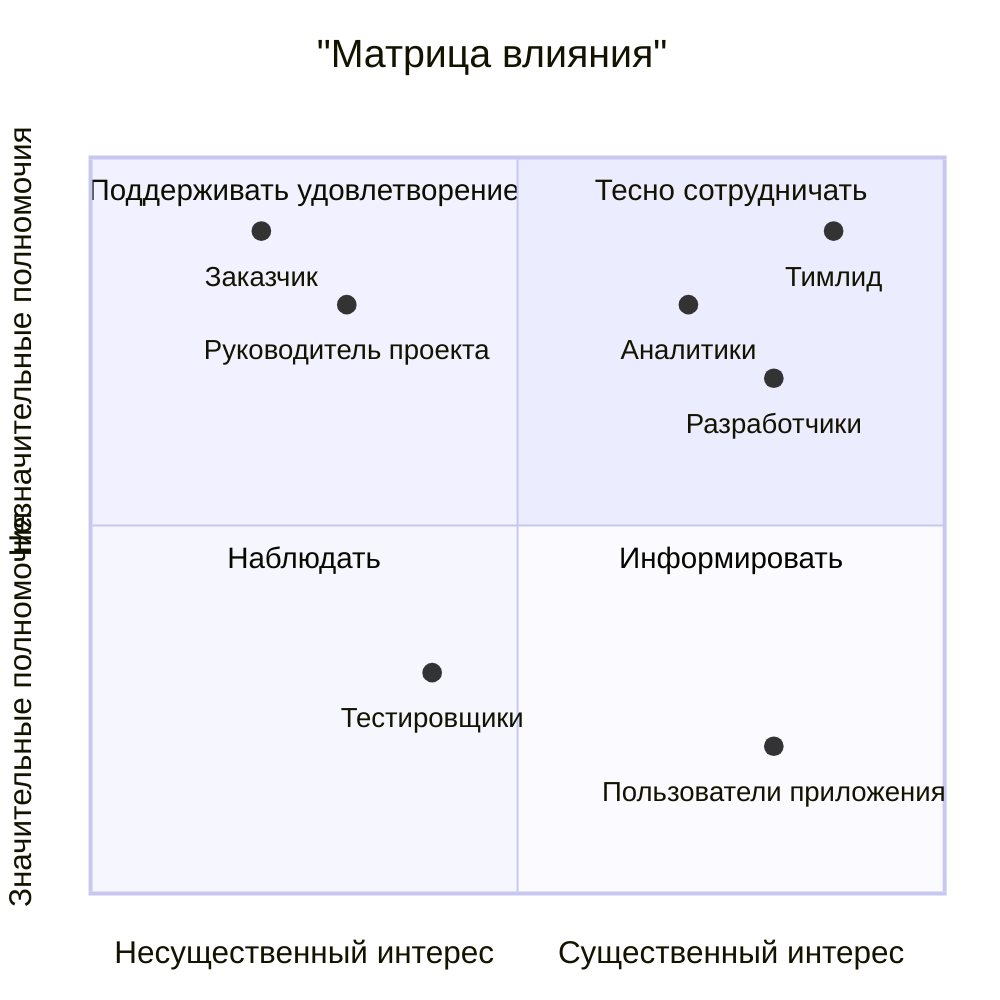

# project-practicum

## Обоснование технологии
|Критерий|Kotlin|Java|Сравнение|
|---------------------------------------|-|-|--------------------------------------------------------------------------------------------------------------------------------------------------------------------------------------------------------------------------------------------------------------------------------------------|
|Простота                               |2|1|Kotlin - более современный и понятный язык, чем Java. При написании кода на Kotlin используется более простой и выразительный синтаксис, что делает разработку более приятной и удобной. Кроме того, Kotlin совместим с Java, что упрощает переход с одного языка на другой.                |
|Производительность                     |1|2|Java, как компилируемый язык, часто работает немного быстрее Kotlin, который требует интерпретации. Однако в реальных проектах разница в производительности обычно незаметна и зависит от конкретных обстоятельств.                                                                         |
|Разработка пользовательского интерфейса|2|1|Kotlin предоставляет более современные и гибкие инструменты для разработки пользовательского интерфейса, чем Java. Kotlin работает с Android Jetpack и Compose, что делает создание интерфейсов более простым и удобным. Java также имеет свои инструменты, но они менее современны и гибки.|
|Гибкость                               |2|1|Kotlin -более гибкий и расширяемый язык, чем Java. В Kotlin можно использовать современные концепции, такие как корутины и расширения функций, что делает разработку более гибкой и удобной. Java, хотя и имеет широкое применение, но менее гибок и ограничен в некоторых аспектах.        |
|Надежность                             |2|1|Kotlin - надежный и стабильный язык программирования с активной поддержкой и обновлениями. Java также надежен, но Kotlin обычно более современен и предлагает более надежные инструменты для разработки.                                                                                    |

## Матрица влияния

## Список операций проекта
|Код|Операция|Срок выполнения|Описание работ|
|-----|--------------------------------------------------|---------|-----------------------------------------------------------------------------------------------|
|01   | Концептуализация                                 |6 недель |                                                                                               |
|01.01|Изучение существующих аналогов                    |3 недели | Анализ существующих приложений и платформ для оценки устойчивости продуктов                   |
|01.02| Определение требований и концепции               |2 недели | Сбор информации о потребностях пользователей и определение основных функций приложения        |
|01.03| Проработка дизайна и пользовательского интерфейса|1 неделя | Разработка концепции дизайна и интерфейса приложения                                          |
|02   | Планирование                                     |3 недели |                                                                                               |
|02.01| Определение сроков и ресурсов                    |1 неделя | Определение временных рамок и необходимых ресурсов для разработки приложения                  |
|02.02| Разработка технического задания                  |2 недели | Написание документации с требованиями и описанием функционала                                 |
|03   | Разработка приложения                            |12 недель|                                                                                               |
|03.01| Написание кода и создание функционала            |6 недель | Реализация основных функций приложения с учетом требований                                    |
|03.02| Разработка пользовательского интерфейса          |4 недели | Создание пользовательского интерфейса с учетом дизайна и концепции приложения                 |
|03.03| Тестирование и отладка                           |2 недели | Проведение тестирования функционала и устранение обнаруженных ошибок                          |
|04   | Завершение и внедрение                           |2 недели |                                                                                               |
|04.01| Подготовка к выпуску                             |2 недели | Подготовка приложения к выпуску, включая проверку и исправление ошибок                        |
|04.02| Поддержка и обновление                           |бессрочно| Поддержка и обновление приложения после его выпуска, внесение изменений по мере необходимости |
